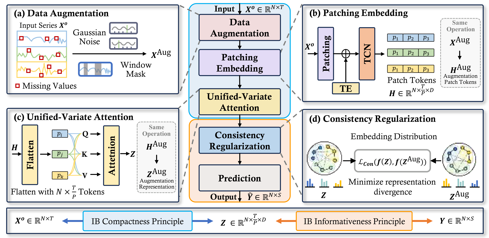

# CRIB: Consistency-Regularized Information Bottleneck for MTSF-M

This repository is the official implementation of **CRIB**, a framework for **multivariate time series forecasting with missing values (MTSF-M)**.

Existing MTSF-M methods follow an *imputation-then-prediction* paradigm: a separate imputation module fills in the missing entries and a forecaster predicts on the imputed series. Because there is **no ground truth for the missing values**, the imputer is in practice supervised only by the downstream forecasting loss, which distorts the joint data distribution and the inter-variate correlations and propagates noise into the prediction stage.

CRIB proposes a **paradigm shift**: forecast **directly** from the partially observed series, with no separate imputation stage. Built on the **Information Bottleneck (IB)** principle, CRIB combines a **unified-variate attention** mechanism with a **consistency regularization** scheme to learn representations that filter out the noise introduced by missing values while preserving the signals that matter for forecasting. CRIB remains accurate even under high missing rates.

This repository also bundles a unified training pipeline for several recent forecasting baselines so that they can be evaluated under the same missing-data protocol.



## Method overview

CRIB has four main components, mirroring the figure above:

1. **Data Augmentation.** A more challenging augmented view $X^{\text{Aug}}$ is generated from the partially observed input $X^{\text{o}}$ via additional random masking (10% extra zeros) and Gaussian noise.
2. **Patching Embedding.** Missing entries are zero-filled (no auxiliary mask channel). The series is split into non-overlapping patches of length $P$, temporal positional encodings are added, and a TCN encodes each patch into dense local features $H, H^{\text{Aug}}$.
3. **Unified-Variate Attention.** All patch tokens across variates and time are flattened into one sequence and processed by a single self-attention block, jointly modeling intra- and inter-variate correlations on sparse data. Patching reduces token count from $T$ to $T/P$, lowering attention cost by $P^2$.
4. **Consistency Regularization.** The refined representations $Z$ and $Z^{\text{Aug}}$ from the two views are aligned, encouraging invariance to different missing patterns and stabilizing training under high missing rates.

A simple two-layer MLP predictor maps $Z$ to the forecast $\widehat{Y}$, isolating gains to the learned representation rather than predictor capacity.

The training objective combines three terms:

$$
\min_{\theta}\ \alpha\,(\mathcal{L}_{\text{Comp}} + \beta\,\mathcal{L}_{\text{Pred}}) + \gamma\,\mathcal{L}_{\text{Consis}}
$$

- **$\mathcal{L}_{\text{Comp}}$** — IB *compactness*: KL between $p_{\theta}(Z\mid X^{\text{o}})=\mathcal{N}(\mu_{\theta}, \sigma_{\theta}^2)$ and an isotropic Gaussian prior $\mathcal{N}(0, I)$, optimized via the reparameterization trick.
- **$\mathcal{L}_{\text{Pred}}$** — IB *informativeness*: standard MSE/MAE prediction loss on $\widehat{Y}$.
- **$\mathcal{L}_{\text{Consis}}$** — consistency: token-wise $\ell_2$ between $Z$ and $Z^{\text{Aug}}$.

In the code these correspond to the three switchable loss terms `1`, `2`, `3` (see `--loss_type`).

## Features

- Forecasting under multiple missing patterns: `point`, `block`, and `col` (column-wise).
- Configurable missing rate and (for block pattern) block width / height.
- Composable training objective with three switchable terms (`--loss_type`):
  - `1` — prediction loss ($\mathcal{L}_{\text{Pred}}$)
  - `2` — consistency regularization ($\mathcal{L}_{\text{Consis}}$, CRIB only)
  - `3` — IB compactness / KL term ($\mathcal{L}_{\text{Comp}}$, CRIB only)
- Mixed-precision training (AMP) and a unified CLI shared by all models.
- **Built-in baselines** (under `TSL_models/`, `PyPOTS_models/`, `NeuralCDE/`):
  - *Forecasters*: `DLinear`, `SegRNN`, `Transformer`, `iTransformer`, `PatchTST`, `TSMixer`, `WPMixer`, `PAttn`, `TimeXer`, `KANAD`, `MultiPatchFormer`, `FreTS`.
  - *MTSF-M / imputation methods*: `BRITS`, `SAITS`, `TimesNet`, `CSDI`, `NeuralCDE`, `ImputeFormer`.
  - All non-MTSF-M forecasters can be evaluated in either **Original** mode (direct prediction on partially observed input) or **Imputed** (two-stage) mode by selecting the corresponding `*_imputed` dataset key.
- **Built-in datasets**: `ETTh1`, `ETTh2`, `ETTm1`, `ETTm2`, `Elec`, `PEMS`, `PEMS08`, `Metr`, `BeijingAir`, `Traffic`, `Weather`, `Exchange`, `Illness`, `AQI_ori` / `AQI_imp`, plus the `*_imputed` two-stage variants.
- **Reproducible sweep scripts** for all main experiments — comparison (`bash/comp/`), ablation (`bash/ablation/`), parameter sensitivity (`bash/sen/`), and training cost (`bash/cost/`).

## Installation (UV and Conda)

The project is managed with [uv](https://docs.astral.sh/uv/). `pyproject.toml` declares the dependencies and `uv.lock` pins the exact resolved versions; `uv sync` reproduces the environment in one step:

```bash
uv sync --frozen          # creates .venv/ from uv.lock
source .venv/bin/activate
```

Equivalent helper: `bash bash/setup_uv_env.sh`.

The default environment targets Python 3.9 + PyTorch 2.1.0 with CUDA 11.8 (the cu118 wheel is pulled from the PyTorch index configured in `pyproject.toml`). To change the CUDA version, edit `[[tool.uv.index]]` in `pyproject.toml` and re-run `uv lock`.

### Smoke test

A 1-epoch end-to-end check (CRIB on ETTh1, ~45 s on a single GPU) lives at `bash/smoke_test.sh`. Edit `DATA_PATH` inside it to point at your data directory, then:

```bash
bash bash/smoke_test.sh
```

### Alternative: conda + pip

The legacy path still works:

```bash
conda create -n crib python=3.9 -y
conda activate crib
pip install -r requirements.txt
```

Note that `requirements.txt` pins torch 2.0.0 / CUDA 11.7; the uv setup uses a newer (and verified working) torch 2.1.0 / CUDA 11.8.

## Data preparation

Place the prepared datasets under `./data` so that the loaders in `utils/utils.py` (`load_dataset`) can find them.

### Datasets used in the paper

The paper evaluates CRIB on **12 real-world MTSF benchmarks**:

| Group                          | Datasets                                |
| ------------------------------ | --------------------------------------- |
| Traffic                        | PEMS-BAY, Metr-LA                       |
| Energy                         | Electricity, ETTh1, ETTh2, ETTm1, ETTm2 |
| Weather / Air quality          | Weather, BeijingAir, AQI                |
| Finance                        | Exchange                                |
| Healthcare (naturally missing) | PhysioNet 2012                          |

Synthetic missingness is generated under three patterns — **point**, **block**, and **column** — at multiple missing rates. AQI and PhysioNet 2012 contain naturally occurring missing values and are used to evaluate the natural-missingness setting.

### Datasets supported by the released code

Variable counts (`utils/args.py:115-186`):

| Dataset key               | Paper name                  | #Variables |
| ------------------------- | --------------------------- | ---------- |
| `ETTh1` / `ETTh2`     | ETTh1 / ETTh2               | 7          |
| `ETTm1` / `ETTm2`     | ETTm1 / ETTm2               | 7          |
| `Elec`                  | Electricity                 | 321        |
| `Metr`                  | Metr-LA                     | 207        |
| `PEMS`                  | PEMS-BAY                    | 325        |
| `PEMS08`                | PEMS08                      | 170        |
| `BeijingAir`            | BeijingAir                  | 7          |
| `BeijingAir_old`        | BeijingAir (36-var variant) | 36         |
| `Traffic`               | Traffic                     | 862        |
| `Weather`               | Weather                     | 21         |
| `Exchange`              | Exchange                    | 8          |
| `Illness`               | Illness                     | 7          |
| `AQI_ori` / `AQI_imp` | AQI (raw / imputed)         | 36         |

Datasets ending in `_imputed` (e.g. `ETTh1_imputed`, `Elec_imputed`, `PEMS_imputed`, `Metr_imputed`) and the `AQI_ori` / `AQI_imp` pair load pre-imputed series and combine them with the original raw values via the missing mask — this reproduces the *Imputed* (two-stage) variant of each baseline.

PhysioNet 2012, used in the paper for the natural-missingness healthcare evaluation, is processed via a separate clinical loader and is not bundled in this snapshot.

## Training

`train.py` is the single entry point and dispatches by `--model`:

- **TSL forecasters** (CRIB, DLinear, SegRNN, Transformer, iTransformer, PatchTST, TSMixer, WPMixer, PAttn, TimesNet, TimeXer, KANAD, MultiPatchFormer, FreTS) and **NeuralCDE** — Adam-optimized loop via `select_model` + `common_training_loop`.
- **PyPOTS imputation models** (CSDI, ImputeFormer) — `model.fit()` / `model.impute()` API; metrics computed against the held-out targets.

### Single run

```bash
python train.py \
    --dataset ETTh1 \
    --model CRIB \
    --missing_pattern point \
    --missing_rate 0.2 \
    --seq_len 24 \
    --pred_len 24 \
    --batch_size 16 \
    --model_dim 32 \
    --train_epochs 10 \
    --seed 0 \
    --csv_path ./result/result.csv \
    --exp_type Train
```

### Batch training via bash

A single sweep script `bash/bash_train.sh` iterates over `datasets × missing_patterns × missing_rates × models × iters`. Edit the arrays at the top of the script to control the sweep — just include / comment out whichever models and datasets you want. Logs are written to `./log/<exp>/<date>/` and aggregated metrics are appended to `./result/<exp>/<date>_*.csv`.

```bash
bash bash/bash_train.sh
```

The default `models=(...)` array covers TSL forecasters (CRIB, DLinear, SegRNN, iTransformer, PatchTST, TSMixer, WPMixer, PAttn, TimesNet, TimeXer), the NeuralCDE baseline, and the PyPOTS imputation baselines (CSDI, ImputeFormer).

## Key arguments

| Argument              | Default   | Description                                                                                                                          |
| --------------------- | --------- | ------------------------------------------------------------------------------------------------------------------------------------ |
| `--model`           | `CRIB`  | One of the built-in models listed above.                                                                                             |
| `--dataset`         | `ETTh1` | Dataset key (see table above).                                                                                                       |
| `--missing_pattern` | `col`   | `point`, `block`, or `col`.                                                                                                    |
| `--missing_rate`    | `0.7`   | Fraction of entries to mask.                                                                                                         |
| `--seq_len`         | `24`    | Input sequence length. Must be divisible by `--patch_len`.                                                                         |
| `--pred_len`        | `24`    | Prediction horizon.                                                                                                                  |
| `--patch_len`       | `8`     | Patch size used by CRIB / patch-based baselines.                                                                                     |
| `--model_dim`       | `32`    | Hidden dimension.                                                                                                                    |
| `--loss_type`       | `123`   | Subset of `{1,2,3}`: prediction / consistency / IB-compactness terms (2, 3 are CRIB-only).                                         |
| `--IB_weight`       | `1.0`   | Outer IB weight$\alpha$ in $\alpha(\mathcal{L}_{\text{Comp}}+\beta\mathcal{L}_{\text{Pred}})+\gamma\mathcal{L}_{\text{Consis}}$. |
| `--KL_weight`       | `1e-6`  | Weight of the IB compactness / KL term ($\mathcal{L}_{\text{Comp}}$).                                                              |
| `--Consis_weight`   | `1.0`   | Weight$\gamma$ of the consistency regularization ($\mathcal{L}_{\text{Consis}}$).                                                |
| `--train_epochs`    | `10`    | Number of training epochs.                                                                                                           |
| `--learning_rate`   | `0.001` | Adam learning rate.                                                                                                                  |
| `--use_amp`         | `True`  | Enable mixed precision.                                                                                                              |
| `--seed`            | `123`   | Random seed (`-1` disables seeding).                                                                                               |
| `--csv_path`        | -         | CSV file to which final test metrics are appended.                                                                                   |

Run `python train.py --help` for the full list of options.

## Output

After each run, `train.py` appends a row to `--csv_path` containing the experiment setting, dataset, model, missing configuration, and final test MAE / MSE / MAPE (mean and variance across batches). The total number of trainable parameters is also printed at the end of training.

## Project structure

```
CRIB/
├── bash/                # bash_train.sh (sweep) | smoke_test.sh | setup_uv_env.sh
├── layers/              # shared transformer / embedding / Conv_Blocks
├── NeuralCDE/           # NeuralCDE baseline
├── pic/                 # figures used in the README
├── PyPOTS_models/       # CSDI, ImputeFormer wrappers (PyPOTS API)
├── revin/               # RevIN normalization (torch & keras)
├── TSL_models/          # CRIB + 13 forecasting baselines
│   ├── CRIB.py / CRIB_module.py / CRIB_embedding.py / CRIB_utils.py
│   ├── DLinear.py / SegRNN.py / Transformer.py / iTransformer.py / ...
│   └── TimesNet.py / TimeXer.py / WPMixer.py / ...
├── utils/               # args, dataset, models, training, metrics, masking, ...
├── train.py             # unified entry point (TSL forecasters / PyPOTS / NeuralCDE)
├── pyproject.toml       # uv-managed dependencies + PyTorch cu118 index
├── uv.lock              # cross-platform locked versions (commit this)
└── requirements.txt     # legacy pip fallback
```
